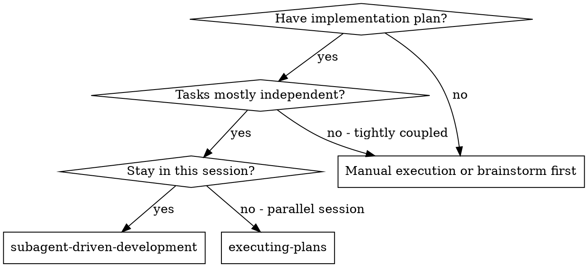
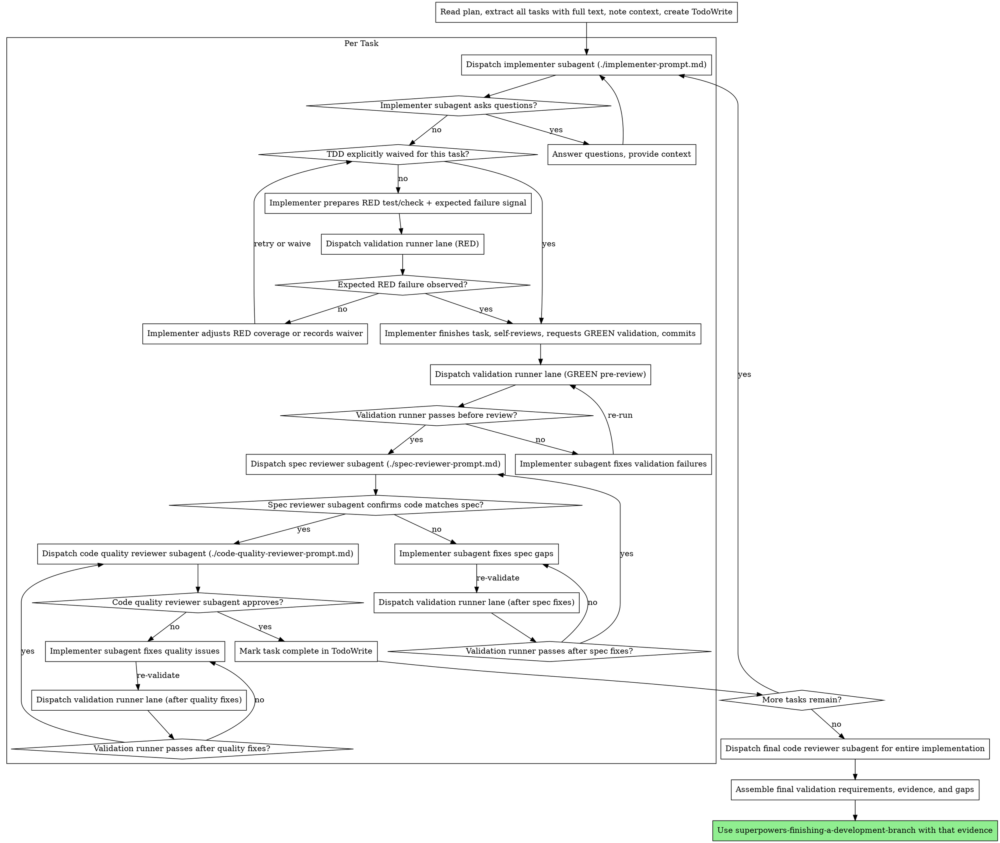

# Subagent-Driven Development

Execute plan by dispatching a fresh implementer subagent per task, proving RED/GREEN through a dedicated validation runner lane when TDD is in force, keeping two-stage review after each, and handing final closure only dedicated validation evidence plus explicit coverage gaps.

**Why subagents:** You delegate tasks to specialized agents with isolated context. By precisely crafting their instructions and context, you ensure they stay focused and succeed at their task. They should never inherit your session's context or history — you construct exactly what they need. This also preserves your own context for coordination work.

**Core principle:** Fresh implementer per task + delegated RED/GREEN runner evidence + two-stage review (spec then quality) + validation-governed closure = high quality, fast iteration

## When to Use



**vs. Executing Plans (parallel session):**

- Same session (no context switch)
- Fresh subagent per task (no context pollution)
- Two-stage review after each task: spec compliance first, then code quality
- Faster iteration (no human-in-loop between tasks)

## The Process



## Model Selection

Use the least powerful model that can handle each role to conserve cost and increase speed.

**Mechanical implementation tasks** (isolated functions, clear specs, 1-2 files): use a fast, cheap model. Most implementation tasks are mechanical when the plan is well-specified.

**Integration and judgment tasks** (multi-file coordination, pattern matching, debugging): use a standard model.

**Architecture, design, and review tasks**: use the most capable available model.

**Task complexity signals:**

- Touches 1-2 files with a complete spec → cheap model
- Touches multiple files with integration concerns → standard model
- Requires design judgment or broad codebase understanding → most capable model

## Delegated RED/GREEN Loop

Treat TDD as the default only when the workflow can produce delegated evidence for it.

1. **Default mode: evidence-backed TDD.** For executable behavior changes, the controller first asks the implementer for the narrowest RED package: the failing test/check to add or update, the exact validation-runner command, and the expected failure signal.
2. **RED must come from the runner lane.** The controller dispatches the dedicated validation runner and captures the failing output. If the runner does not fail for the expected reason, the controller does not claim TDD happened yet.
3. **Only after RED evidence does GREEN work start.** Re-dispatch the implementer with the RED evidence so it can make the minimum change, self-review, and request GREEN validation.
4. **GREEN must also come from the runner lane.** Only dedicated validation-runner pass evidence unlocks review.
5. **Waivers must be explicit.** If the task is docs-only, pure scaffolding, a refactor with already-sufficient failing coverage, or otherwise not practical for a fresh RED step, the controller may waive TDD — but it must record that waiver and stop describing the slice as evidence-backed TDD.

## Validation Boundary

Keep the execution boundary explicit:

- **Implementer lane:** changes code, adds or updates tests, prepares RED or GREEN validation requests, self-reviews, and proposes the narrowest validation scope needed to verify the task.
- **Validation runner lane:** executes the requested test commands or checks and returns raw results. This lane does **not** modify code.
- **Controller lane:** decides whether TDD is active or explicitly waived, dispatches RED/GREEN runner requests, and only advances to review once GREEN validation results are back and acceptable.

**Never treat implementer-reported "tests passed" as authoritative.** The implementer can say what should be run, but both the RED fail signal and the GREEN pass signal must come from the dedicated validation runner lane whenever TDD is in force.

Before final closure, assemble a small validation handoff for the finisher workflow:

- required validation layers (`unit`, `integration`, `e2e`, `browser`, `manual`) and why they were or were not required
- latest dedicated validation-runner evidence for each required layer
- any explicit coverage gaps, limitations, or lowered-confidence notes
- confirmation that any direct test commands were executed by the validation lane itself rather than by the implementer/controller lane claiming completion

Do not hand the finisher workflow a bare "all tests pass" summary. Hand it the validation package.

## Handling Implementer Status

Implementer subagents report one of four statuses. Handle each appropriately:

**DONE:** Read the reported phase.

- If the phase is `RED_READY`, dispatch the dedicated validation runner for the expected failing check. Only move on once you have real RED evidence or you explicitly waive TDD for this slice.
- If the phase is `GREEN_READY`, dispatch the dedicated validation runner next. Only proceed to spec compliance review after GREEN validation passes.

**DONE_WITH_CONCERNS:** Same phase handling as `DONE`, but read the concerns before proceeding. If the concerns are about correctness or scope, address them before review. If they're observations (e.g., "this file is getting large"), note them and proceed through the RED/GREEN loop, then review.

**NEEDS_CONTEXT:** The implementer needs information that wasn't provided. Provide the missing context and re-dispatch.

**BLOCKED:** The implementer cannot complete the task. Assess the blocker:

1. If it's a context problem, provide more context and re-dispatch with the same model
2. If the task requires more reasoning, re-dispatch with a more capable model
3. If the task is too large, break it into smaller pieces
4. If the plan itself is wrong, escalate to the human

**Never** ignore an escalation or force the same model to retry without changes. If the implementer said it's stuck, something needs to change.

## Prompt Templates

- `./implementer-prompt.md` - Dispatch implementer subagent
- `./spec-reviewer-prompt.md` - Dispatch spec compliance reviewer subagent
- `./code-quality-reviewer-prompt.md` - Dispatch code quality reviewer subagent

## Example Workflow

```
You: I'm using Subagent-Driven Development to execute this plan.

[Read plan file once: docs/superpowers/plans/feature-plan.md]
[Extract all 5 tasks with full text and context]
[Create TodoWrite with all tasks]

Task 1: Hook installation script

[Get Task 1 text and context (already extracted)]
[Dispatch implementation subagent with full task text + context]

Implementer: "Before I begin - should the hook be installed at user or system level?"

You: "User level (~/.config/superpowers/hooks/)"

Implementer: "Got it. Implementing now..."
[Later] Implementer:
  - Added focused install-hook tests
  - Phase: RED_READY
  - Expected RED signal: install-hook test fails because --force behavior is not implemented yet
  - Requested validation: run install-hook test file only

[Dispatch validation runner lane]
Validation runner: ✅ RED confirmed - install-hook test fails because --force behavior is missing

[Re-dispatch implementer with RED evidence]
Implementer:
  - Implemented install-hook command
  - Kept focused install-hook tests
  - Phase: GREEN_READY
  - Requested validation: run install-hook test file and hook install smoke check
  - Self-review: Found I missed --force flag, added it
  - Committed

[Dispatch validation runner lane]
Validation runner: ✅ Requested test file 5/5 passing; smoke check passing

[Dispatch spec compliance reviewer]
Spec reviewer: ✅ Spec compliant - all requirements met, nothing extra

[Get git SHAs, dispatch code quality reviewer]
Code reviewer: Evidence reviewed: requested test file 5/5 passing; smoke check passing. APPROVED.

[Mark Task 1 complete]

Task 2: Recovery modes

[Get Task 2 text and context (already extracted)]
[Dispatch implementation subagent with full task text + context]

Implementer: [No questions, proceeds]
Implementer:
  - Added verify/repair modes
  - Added coverage for verify/repair flows after RED was confirmed for this slice
  - Phase: GREEN_READY
  - Requested validation: run recovery-mode tests only
  - Self-review: All good
  - Committed

[Dispatch validation runner lane]
Validation runner: ❌ Recovery-mode test run failed: missing progress reporting assertion

[Implementer fixes validation issue]
Implementer: Added progress reporting output and updated targeted tests

[Dispatch validation runner lane again]
Validation runner: ✅ Recovery-mode tests passing

[Dispatch spec compliance reviewer]
Spec reviewer: ❌ Issues:
  - Missing: Progress reporting (spec says "report every 100 items")
  - Extra: Added --json flag (not requested)

[Implementer fixes issues]
Implementer: Removed --json flag, kept progress reporting, requested same recovery-mode validation

[Dispatch validation runner lane again]
Validation runner: ✅ Recovery-mode tests passing

[Spec reviewer reviews again]
Spec reviewer: ✅ Spec compliant now

[Dispatch code quality reviewer]
Code reviewer: Evidence reviewed: recovery-mode tests passing. Important: Magic number (100). NEEDS_REVISION

[Implementer fixes]
Implementer: Extracted PROGRESS_INTERVAL constant

[Dispatch validation runner lane again]
Validation runner: ✅ Recovery-mode tests passing

[Code reviewer reviews again]
Code reviewer: Evidence reviewed: recovery-mode tests passing. APPROVED

[Mark Task 2 complete]

...

[After all tasks]
[Dispatch final code-reviewer]
Final reviewer: All requirements met. Evidence reviewed: unit runner passing; integration not required for this slice.

[Assemble final validation package]
- Validation requirements: unit required, integration not required, e2e not required
- Tested coverage: unit runner 12/12 passing
- Coverage gaps: none

Done!
```

## Advantages

**vs. Manual execution:**

- Subagents can still follow an evidence-backed RED/GREEN loop while routing execution through a dedicated validation lane
- Fresh context per task (no confusion)
- Parallel-safe (subagents don't interfere)
- Subagent can ask questions (before AND during work)

**vs. Executing Plans:**

- Same session (no handoff)
- Continuous progress (no waiting)
- Review checkpoints automatic

**Efficiency gains:**

- No file reading overhead (controller provides full text)
- Controller curates exactly what context is needed
- Subagent gets complete information upfront
- Questions surfaced before work begins (not after)

**Quality gates:**

- Self-review catches issues before handoff
- Validation results come from a dedicated runner lane, not the implementer
- Two-stage review: spec compliance, then code quality
- Review loops ensure fixes actually work
- Spec compliance prevents over/under-building
- Code quality ensures implementation is well-built
- Final closure consumes validation requirements/evidence, not a raw green test claim

**Cost:**

- More subagent invocations (implementer + validation runner + 2 reviewers per task)
- Controller does more prep work (extracting all tasks upfront)
- Review loops add iterations
- But catches issues early (cheaper than debugging later)

## Red Flags

**Never:**

- Start implementation on main/master branch without explicit user consent
- Skip reviews (spec compliance OR code quality)
- Proceed with unfixed issues
- Dispatch multiple implementation subagents in parallel (conflicts)
- Make subagent read plan file (provide full text instead)
- Skip scene-setting context (subagent needs to understand where task fits)
- Ignore subagent questions (answer before letting them proceed)
- Accept "close enough" on spec compliance (spec reviewer found issues = not done)
- Skip review loops (reviewer found issues = implementer fixes = review again)
- Let implementer self-review replace actual review (both are needed)
- Let implementer self-run or self-certify validation that should come from a runner lane
- Skip the RED runner step while still calling the task "TDD" unless you explicitly recorded a waiver
- **Start code quality review before spec compliance is ✅** (wrong order)
- Move to next task while either review has open issues
- Hand off to finishing with only "tests pass" and no validation requirements/evidence package

**If subagent asks questions:**

- Answer clearly and completely
- Provide additional context if needed
- Don't rush them into implementation

**If reviewer finds issues:**

- Implementer (same subagent) fixes them
- Re-run the narrowest relevant validation through the validation runner lane
- Reviewer reviews again
- Repeat until approved
- Don't skip the re-review

**If subagent fails task:**

- Dispatch fix subagent with specific instructions
- Don't try to fix manually (context pollution)

## Integration

**Required workflow skills:**

- **superpowers-using-git-worktrees** - REQUIRED: Set up isolated workspace before starting
- **superpowers-writing-plans** - Creates the plan this skill executes
- **superpowers-requesting-code-review** - Code review template for reviewer subagents
- **superpowers-finishing-a-development-branch** - Complete development after all tasks

**Subagents should use:**

- **superpowers-test-driven-development** - Subagents follow TDD for each task

**Alternative workflow:**

- **superpowers-executing-plans** - Use for parallel session instead of same-session execution
