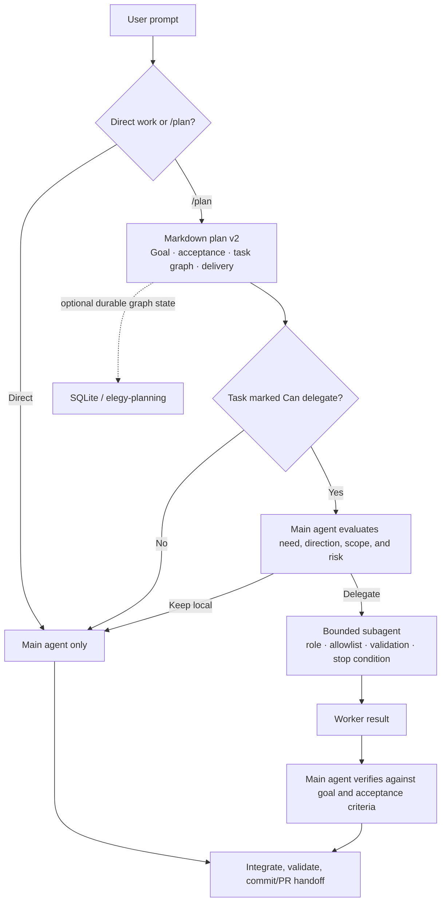

# Codex Subagent Control Plane

Purpose: keep the main Codex agent focused on requirements, direction,
integration, and final judgment while using bounded subagents for explicit
planned work, parallel exploration, context isolation, and independent
challenge. Native Codex owns the subagent lifecycle; this document defines the
Instruction Engine policy around it.

## Contract

| Owner | Responsibility |
|---|---|
| Codex main thread | Requirements, architecture, integration, final judgment |
| Approved Markdown plan | Goal, acceptance criteria, task graph, delegation marks, validation, delivery |
| Codex baseline agent TOML | Role, model, effort, sandbox, prompt |
| Elegy Copilot UI | Inspect the native receipt; manage only Elegy-owned compatibility assets and show usage |
| Native Codex config | `[agents]` concurrency and depth limits |
| Local telemetry | Derived usage metadata only |

## Delegation policy

There is no separate orchestrator gate or automatic delegation service. The
main agent is the orchestrator and evaluates whether the requested work and
the selected direction are correct.

Direct work is main-agent only by default. Use a subagent only when the user
explicitly asks for one. A direct request to review or investigate can be
handled as a bounded subagent request when the scope and result are clear.

When `/plan` is active or an approved Markdown plan is being executed, the
plan is the delegation boundary:

- Delegate only tasks explicitly marked as delegable.
- Prefer independent exploration, isolated implementation, noisy validation,
  long-running checks, and independent review.
- Keep requirements, architecture, trade-offs, integration, and final
  acceptance with the main agent.
- Keep tasks local when they are tiny, serial, unclear, coupled, write
  conflicting, or cheaper to complete inline.
- Give each delegated task a bounded scope, expected result, validation, and
  stop condition. Workers never commit, push, publish, change permissions,
  spawn children, or edit outside their scope.
- The main agent checks the result against the user goal, planned acceptance
  criteria, and the necessity and direction of the work before integrating it.

The Markdown plan is the default durable artifact. It owns approved intent,
decisions, acceptance criteria, task dependencies, delegation marks, and
delivery expectations. SQLite or `elegy-planning` may be used as an optional
execution backend when durable graph state, leases, or resume support
materially help; it must not replace the Markdown plan or silently broaden
scope.

Legacy `routingMode` settings remain readable for compatibility and telemetry,
but they are not an execution gate. Installed Codex instructions and the
approved plan define delegation behavior.



## Managed agents

| Agent | Default model | Effort | Sandbox | Use |
|---|---|---|---|---|
| `explorer` | `gpt-5.6-luna` | inherited (`high`) | `read-only` | Noisy repo mapping and non-trivial investigation |
| `reviewer` | `gpt-5.6-luna` | inherited (`high`) | `read-only` | Bounded implementation review |
| `reviewer_strong` | `gpt-5.6-sol` | inherited (`high`) | `read-only` | Complex or consequential independent review |
| `worker` | `gpt-5.6-luna` | inherited (`high`) | `workspace-write` | Bounded implementation with explicit ownership |
| `test-runner` | `gpt-5.6-luna` | inherited (`high`) | `workspace-write` | Bounded validation output |
| `sweeper` | `gpt-5.6-luna` | inherited (`high`) | `workspace-write` | Bounded cleanup |

The bounded utility lane is capped to Luna and defaults to `high`, including
exploration, implementation, and routine review. `reviewer_strong` is the
explicit Sol exception for judgment-heavy review. Role files intentionally omit
`model_reasoning_effort`, so Sol may choose `xhigh` or `max` for a complex
delegation. Use `low` only for trivial discovery and `medium` only for routine
mechanical work.

## Review routing

Independence determines whether review should be delegated. Complexity and
consequence determine the model:

| Review | Default owner |
|---|---|
| Bounded diff correctness, regressions, conventions, request fit, missing tests | `reviewer` (Luna) |
| Complex plans, architecture, security, privacy, migrations, data-loss risk, cross-cutting changes, disputed findings | `reviewer_strong` (Sol) |
| Requirements, trade-offs, integration, final validation, approval, closure, answer | Main agent |

Both reviewers are read-only and advisory. The main agent verifies and
reconciles their findings, including whether the planned problem and chosen
direction remain the right ones.

## Native Codex baseline

Codex owns its native subagent lifecycle and configuration. The current receipt
is intentionally small and is the source of truth for the Codex manifest:

- Six native, harness-owned agents: `explorer`, `reviewer`, `reviewer_strong`,
  `worker`, `test-runner`, and `sweeper`.
- Six Elegy-managed compatibility skills retained for fallback workflows.
- Four Codex marketplace plugins: `elegy-documentation`, `elegy-mcp`,
  `elegy-checks`, and `elegy-planning`.

`elegy-planning` is the direct Codex subagent/workflow integration. Codex does
not use a native-Go lane, OpenAI fallback agent variants, Moon Bridge, or a
Codex-side OpenCode Worker relay. OpenCode Go and OpenCode Worker features remain
OpenCode-only.

The installed `[agents]` policy is:

```toml
[agents]
enabled = true
max_concurrent_threads_per_session = 6
default_subagent_model = "gpt-5.6-luna"
default_subagent_reasoning_effort = "high"
max_depth = 1
job_max_runtime_seconds = 1800
```

The `explorer` agent is one configurable agent, not a family of provider
variants. Use a prompt mode when the investigation needs a specific shape:

| Mode | Use |
|---|---|
| `pattern-discovery` | Find existing conventions or similar code |
| `trace` | Follow an execution path |
| `dependency-map` | Map dependencies and reverse dependencies |
| `search` | Find references to a symbol or pattern |
| `architecture` | Map module boundaries and data flow |

## Capability truth labels

| Label | Meaning |
|---|---|
| Enforced | Codex or app setting prevents access |
| Configured | Agent TOML requests the behavior |
| Inherited | Parent Codex session may still provide it |
| Observed | Local telemetry saw usage |

MCP tool scoping is not claimed as hard isolation. Current Codex behavior can
inherit parent MCP servers into subagents. Use lean Codex profiles for
subagent-heavy sessions until Codex supports per-agent MCP exclusion.

## UI surface

Path: Codex Settings.

Tabs:

- Overview: native Codex CLI health, the expected `[agents]` receipt, and the
  current read-only marketplace plugin status.
- Assets: Codex manifest inventory, including harness-owned native agents and
  Elegy-managed compatibility assets with their scope and action rules.
- Subagents: read-only native agent status, delegation policy, concurrency,
  project agent discovery, and recent runtime state.
- Usage: local derived run metadata.

Native agents, Codex configuration, and marketplace plugin status are
read-only in these views because Codex or the marketplace is their source of
truth. Managed compatibility assets can be synchronized from the Codex Assets
tab. Plugin installation and updates remain in the Maintenance marketplace.

Heavy details stay behind expansion: developer instructions, capability truth
labels, raw TOML, and tool-scope notes. Public usage telemetry exposes only
file names for its state/rollout source labels; it does not expose local home
or repository paths. Project-scoped `.codex/agents` entries are discovery-only
in the UI and are edited in the project repository.

This policy follows OpenAI's current Codex guidance to keep requirements and
integration in the main thread, use subagents for context isolation and
parallel work, prefer bounded prompts with explicit outputs, and avoid
overlapping write-heavy scopes. See the official
[Subagents](https://learn.chatgpt.com/docs/agent-configuration/subagents) and
[Best practices](https://learn.chatgpt.com/guides/best-practices) guides.

## Installation authority

Instruction Engine owns the durable global policy installed at
`~/.codex/AGENTS.md`. It composes
`catalog-assets/instructions/agent-session-defaults.md` with
`codex-assets/home/AGENTS-appendix.md`; `codex-assets/home/AGENTS.md` is only a
source-tree marker and is not an install source. The CLI setup and desktop
asset installer use this same manifest-driven composition.

The managed inventory records the installed hash. A later setup run replaces
an older managed version when its current hash still matches that inventory,
but preserves a file whose hash shows a user edit. Do not duplicate this
durable policy in Codex custom instructions. Use `~/.codex/config.toml` for
model, effort, concurrency, and depth settings.

Codex loads `~/.codex/AGENTS.override.md` instead of `AGENTS.md` when the
override exists. Setup installs the managed file but reports this condition;
merge or remove the override to activate the managed global policy. A legacy
install with no trustworthy inventory remains protected as drift and requires
an explicit reset or `--force`.

## Telemetry

Source:

```text
~/.codex/state_5.sqlite
  -> thread_spawn_edges
  -> threads
  -> rollout_path JSONL
```

Persist or display:

- agent name
- model and effort
- sandbox
- parent/child thread IDs
- token counts
- tool names and counts
- completion/error flags
- provider ID/profile/role, model source, resolved model ID, requested release,
  reasoning effort, timestamps, cost policy, write mode, scope status, and job
  identifier when present

Do not persist prompts, responses, tool arguments, or tool outputs.

## Validation

Use:

- `node scripts/validate-codex-assets.js`
- `node scripts/codex-config-patch.test.js`
- `node scripts/validate-plan.v2.test.js`
- `node scripts/validate-planpack.planning-phase.test.js`
- `node scripts/codex-install.test.js`
- `node --test copilot-ui/tests/codex-subagents-service.test.js copilot-ui/tests/telemetry-service.test.js`
- `npm run ui:check`
