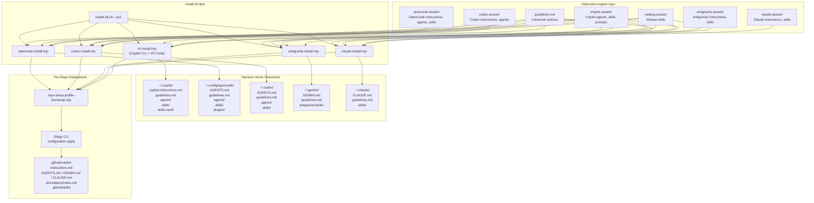

# Harness Asset Flow

## Purpose

Document how central assets from the instruction-engine repo are deployed to each harness home directory, and how per-repo files are discovered (not created) by Elegy Copilot.

## Central Asset Sources

Central assets live in the instruction-engine repo under these directories:

| Directory | Purpose |
|-----------|---------|
| `engine-assets/` | Core agents, skills, prompts, and instructions for Copilot |
| `catalog-assets/shared-skills/` | Shared skills referenced by multiple harness manifests |
| `opencode-assets/` | OpenCode-specific instructions, agents, skills, plugins |
| `codex-assets/` | Codex-specific instructions, agents, skills |
| `antigravity-assets/` | Antigravity-specific instructions and skills |
| `claude-assets/` | Claude Code-specific instructions and skills |
| `guidelines.md` | Universal instruction writing contract (deployed to all harnesses) |

## Architecture Diagram



## Two-Tier Model

### Tier 1: Home-Level Deployment (install scripts)

Install scripts deploy central assets to harness home directories. These are **created by** the install process.

```text
instruction-engine repo
  ├── engine-assets/      ──┐
  ├── catalog-assets/     ──┤── shared sources
  ├── opencode-assets/    ──┤
  ├── codex-assets/       ──┤
  ├── antigravity-assets/ ──┤
  ├── claude-assets/      ──┘
  │
  └── install scripts
        │
        ├── cli-install.mjs       ──→ ~/.copilot/
        ├── opencode-install.mjs  ──→ ~/.config/opencode/
        ├── codex-install.mjs     ──→ ~/.codex/
        ├── antigravity-install.mjs ──→ ~/.gemini/
        └── claude-install.mjs    ──→ ~/.claude/
```

Each harness gets:
- **Instructions file** (`AGENTS.md`, `GEMINI.md`, `CLAUDE.md`, or `copilot-instructions.md`)
- **`guidelines.md`** — the universal instruction writing contract
- **Skills** — shared skills from `engine-assets/` and `catalog-assets/`
- **Agents** (where applicable) — harness-specific agent files
- **Plugins** (OpenCode only) — worktree plugin

### Tier 2: Per-Repo Discovery (repo-setup-profile-bootstrap)

Per-repo files are **discovered by** Elegy Copilot, not created by it. When `--repo-root` is provided to any installer, `repo-setup-profile-bootstrap.mjs` runs the Elegy CLI to patch bounded overlays into repo-local instruction files.

```text
~/.copilot/ or ~/.config/opencode/ etc.
  │
  └── repo-setup-profile-bootstrap.mjs
        │
        ├── Elegy CLI configuration apply
        │     └── Patches spec-driven overlays into:
        │           ├── .github/copilot-instructions.md
        │           └── AGENTS.md / GEMINI.md / CLAUDE.md
        │
        ├── Creates: docs/specs/index.md
        ├── Adds: package.json validate:specs script
        └── Mirrors: skills → .github/skills/
```

Per-repo files are created by the **repo owner** (human or CI), not by the install process. Elegy Copilot's role is to validate and patch overlays when the owner opts in.

## Harness Comparison

| Dimension | Copilot | OpenCode | Codex | Antigravity | Claude |
|-----------|---------|----------|-------|-------------|--------|
| **Home** | `~/.copilot` | `~/.config/opencode` | `~/.codex` | `~/.gemini` | `~/.claude` |
| **Instructions** | `copilot-instructions.md` | `AGENTS.md` | `AGENTS.md` | `GEMINI.md` | `CLAUDE.md` |
| **guidelines.md** | Yes | Yes | Yes | Yes | Yes |
| **Agents** | 6 | 7 | 1 | 0 | 0 |
| **Skills** | 22+ | 18 | 12 | 9 | 6+ |
| **Plugins** | 0 | 2 | 0 | 0 | 0 |
| **Managed block** | No | No | No | Yes | No |
| **Profile injection** | No | Yes | No | No | No |
| **Install script** | `cli-install.mjs` | `opencode-install.mjs` | `codex-install.mjs` | `antigravity-install.mjs` | `claude-install.mjs` |

## guidelines.md Deployment

`guidelines.md` is deployed to every harness home as a standalone file. The instruction file in each harness references it with the recommended pointer:

```text
Follow `guidelines.md`: clarify ambiguity before implementation; write concise, precise, diagram-forward instructions; avoid vague or ceremonial prose.
```

Since `guidelines.md` exists in the same home directory, the pointer resolves locally. The agent can read it to get the full instruction writing contract (concise writing rules, clarification contract, planning contract, review rules).

## Validation

- `node scripts/validate-guidelines-wiring.mjs` — checks all 5 harness instruction files reference `guidelines.md` with the recommended pointer format
- `node scripts/validate-installed-governance-wiring.test.js` — validates installed governance wiring across harnesses

## References

- `guidelines.md` — the universal instruction writing contract
- `docs/system/concise-instruction-governance.md` — canonical authority for concise instruction standards
- `docs/system/repo-setup-governance.md` — per-repo overlay and bootstrap governance
- `scripts/install-surface-utils.mjs` — shared sync primitives (SHA-256, copy, mkdir)
