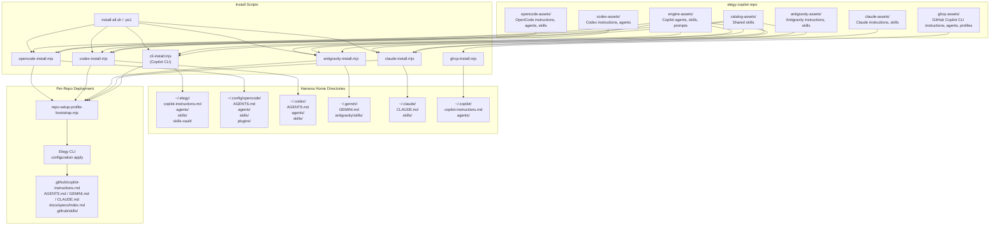

# Harness Asset Flow

## Purpose

Document how central assets from the elegy-copilot repo are deployed to each harness home directory, and how per-repo files are discovered (not created) by Elegy Copilot.

## Central Asset Sources

Central assets live in the elegy-copilot repo under these directories:

| Directory | Purpose |
|-----------|---------|
| `engine-assets/` | Core agents, skills, prompts, and instructions for Copilot |
| `catalog-assets/shared-skills/` | Shared skills referenced by multiple harness manifests |
| `vendor-assets/` | License-approved vendor skills copied from pinned upstream refs |
| `opencode-assets/` | OpenCode-specific instructions, agents, skills, plugins |
| `codex-assets/` | Codex-specific instructions, agents, skills |
| `antigravity-assets/` | Antigravity-specific instructions and skills |
| `claude-assets/` | Claude Code-specific instructions and skills |
| `ghcp-assets/` | GitHub Copilot CLI instructions, lane agents, profiles, and wrapper |

## Architecture Diagram



> **Note:** All install scripts now compose a shared baseline (`catalog-assets/instructions/agent-session-defaults.md`) with a harness-specific appendix before syncing the final instruction file to the harness home directory. See [Instruction Writing Contract](#instruction-writing-contract) below.

## Two-Tier Model

### Tier 1: Home-Level Deployment (install scripts)

Install scripts deploy central assets to harness home directories. These are **created by** the install process.

```text
elegy-copilot repo
  ├── engine-assets/      ──┐
  ├── catalog-assets/     ──┤── shared sources
  ├── opencode-assets/    ──┤
  ├── codex-assets/       ──┤
  ├── antigravity-assets/ ──┤
  ├── claude-assets/      ──┤
  ├── ghcp-assets/        ──┘
  │
  └── install scripts
        │
        ├── cli-install.mjs       ──→ ~/.elegy/
        ├── opencode-install.mjs  ──→ ~/.config/opencode/
        ├── codex-install.mjs     ──→ ~/.codex/
        ├── antigravity-install.mjs ──→ ~/.gemini/
        ├── claude-install.mjs    ──→ ~/.claude/
        └── ghcp-install.mjs      ──→ ~/.copilot/
```

Each harness gets:
- **Instructions file** (`AGENTS.md`, `GEMINI.md`, `CLAUDE.md`, or `copilot-instructions.md`)
- **Skills** — shared skills from `engine-assets/`, `catalog-assets/`, and approved `vendor-assets/`
- **Agents** (where applicable) — harness-specific agent files
- **Plugins** (OpenCode only) — worktree plugin

GHCP gets lane agents plus wrapper/profile assets rather than a shared skill install surface.
GHCP uses its dedicated installer and is not part of `install-all.sh` / `install-all.ps1`.

Codex also gets two managed configuration surfaces:
- root `config.toml` defaults for install-safe shared settings such as `review_model`
- a separate named profile overlay file (`<profile>.config.toml`) for the managed review/planning profile

Installer writes now use temp-sibling replace semantics for file and directory updates so managed
refreshes do not rely on delete-then-copy for normal overwrite paths.

The portable session contract (repo discovery, instruction content, clarification, planning,
long-running work, documentation shape, review, validation, and Git checkpoints) is maintained in
a single shared baseline at `catalog-assets/instructions/agent-session-defaults.md`. At install
time, each harness installer composes the shared baseline with a harness-specific appendix to
produce the installed instruction file.

Vendor assets are shipped only when a pinned source, compatible license, and validation script exist.
Impeccable is retained as attributed research only; governed UI capabilities ship through the
Elegy-owned `elegy-ui-craft@elegy` plugin. ui.sh/TypeUI remains intentionally excluded because its
EULA does not allow redistributing standalone skill resources.

### Tier 2: Per-Repo Discovery (repo-setup-profile-bootstrap)

Per-repo files are **discovered by** Elegy Copilot, not created by it. When `--repo-root` is provided to any installer, `repo-setup-profile-bootstrap.mjs` runs the Elegy CLI to patch bounded overlays into repo-local instruction files.

```text
~/.elegy/ or ~/.config/opencode/ etc.
  │
  └── repo-setup-profile-bootstrap.mjs
        │
        ├── Elegy CLI configuration apply
        │     └── Patches spec-driven overlays into:
        │           ├── .github/copilot-instructions.md
        │           └── AGENTS.md / GEMINI.md / CLAUDE.md
        │
        ├── Creates: docs/specs/index.md
        ├── Adds: (none — validator installation was removed June 2026)
        └── Mirrors: skills → .github/skills/
```

Per-repo files are created by the **repo owner** (human or CI), not by the install process. Elegy Copilot's role is to validate and patch overlays when the owner opts in.

### Desktop Packaging Tier (Tauri sidecar manifest)

The packaged desktop app is a third asset-consumption tier. The Tauri sidecar layout manifest at `copilot-ui/resources/runtime-manifests/windows-tauri-node-sidecar.json` declares which central asset directories are staged into the installer's `resources/` directory at package time. The packaged backend resolves `engineRoot` to that `resources/` directory, so every runtime read of a central asset path must be covered by a `resourceCopies` entry or the installed app will fail with ENOENT.

The manifest bundles:

- `engine-assets` and `catalog-assets` (shared sources)
- All five harness-specific asset directories: `codex-assets`, `opencode-assets`, `claude-assets`, `antigravity-assets`, `ghcp-assets`
- The `local-repo-mcp` runtime package (`dist`, `node_modules`, `package.json`), which the local MCP server spawns against at runtime. Because the repo uses npm workspaces, `local-repo-mcp`'s runtime dependencies (`@modelcontextprotocol/sdk`, `jose`, `zod` and transitives) are hoisted to the root `node_modules/` in development. The bundle preparation script (`prepare-tauri-windows-bundle.js`) stages this hoisted closure from the root `node_modules/` into `resources/local-repo-mcp/node_modules/` at package time so the spawned MCP server process has a complete dependency tree.

A runtime asset drift guard in `copilot-ui/scripts/tauri-node-sidecar-layout.js` scans `copilot-ui/{server.js,lib,routes}` for harness-asset path references and `resolveMcpPackageRoot` usage, then asserts each referenced root has a matching `resourceCopies` entry. This guard runs as part of `validate:tauri-node-sidecar-layout` and `desktop:check`. The native desktop smoke lane additionally probes `POST /api/local-repo-mcp/start` to verify the bundled MCP package actually launches.

## Harness Comparison

| Dimension | Copilot | OpenCode | Codex | Antigravity | Claude | GHCP |
|-----------|---------|----------|-------|-------------|--------|------|
| **Home** | `~/.elegy` | `~/.config/opencode` | `~/.codex` | `~/.gemini` | `~/.claude` | `~/.copilot` |
| **Instructions** | `copilot-instructions.md` | `AGENTS.md` | `AGENTS.md` | `GEMINI.md` | `CLAUDE.md` | `copilot-instructions.md` |
| **Contract** | Composed baseline+profile+appendix | Composed baseline+profile+appendix | Composed baseline+profile+appendix | Composed baseline+profile+appendix | Composed baseline+profile+appendix | Composed baseline+appendix |
| **Agents** | 6 | 15 | 2 | 0 | 0 | 6 |
| **Skills** | 26 | 31 | 19 | 15 | 10 | 0 |
| **Plugins** | 0 | 4 | 0 | 0 | 0 | 0 |
| **Managed block** | No | No | No | Yes | No | No |
| **Profile injection** | Yes | Yes | Yes | Yes | Yes | No |
| **Install script** | `cli-install.mjs` | `opencode-install.mjs` | `codex-install.mjs` | `antigravity-install.mjs` | `claude-install.mjs` | `ghcp-install.mjs` |

## Instruction Writing Contract

The instruction writing contract lives in a single shared portable baseline at `catalog-assets/instructions/agent-session-defaults.md`. An optional user collaboration profile (`~/.elegy/config.json`) is injected between the baseline and appendix. Harness-specific content stays in per-harness appendix files. Installers compose baseline + profile + appendix via `scripts/instruction-compose-utils.mjs` to produce each installed instruction file. The canonical source for repo policy is `docs/system/concise-instruction-governance.md`. See `docs/system/collaboration-profile-adr.md` for the profile architecture.

## Validation

- `node scripts/validate-instruction-wiring.mjs` — validates baseline structure, manifest composition,
  harness appendix ownership, shared skill routes, and retired-reference removal
- `node scripts/validate-manifest.js` — validates manifest IDs, destinations, source paths, required
  assets, and generated-manifest parity
- Run the changed harness's focused check:

| Harness | Focused check |
|---|---|
| Elegy Copilot | `node --test scripts/cli-install.test.js` |
| Codex | `node --test scripts/codex-install.test.js` |
| OpenCode | `node --test scripts/opencode-install.test.js` |
| Antigravity | `node --test scripts/antigravity-install.test.js` |
| Claude Code | `node scripts/claude-install.mjs --dry-run` |
| GitHub Copilot CLI | `npm run install:ghcp:dry` |

## References

- `docs/system/concise-instruction-governance.md` — canonical authority for concise instruction standards
- `docs/system/repo-setup-governance.md` — per-repo overlay and bootstrap governance
- `scripts/install-surface-utils.mjs` — shared sync primitives (SHA-256, copy, mkdir)
- `scripts/codex-config-patch.mjs` — Codex root-config patching plus named profile overlay generation
- `docs/system/collaboration-profile-adr.md` — collaboration profile architecture and composition decision
