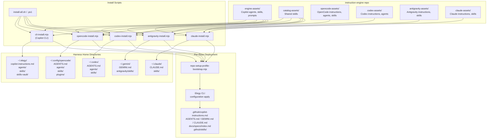

# Harness Asset Flow

## Purpose

Document how central assets from the instruction-engine repo are deployed to each harness home directory, and how per-repo files are discovered (not created) by Elegy Copilot.

## Central Asset Sources

Central assets live in the instruction-engine repo under these directories:

| Directory | Purpose |
|-----------|---------|
| `engine-assets/` | Core agents, skills, prompts, and instructions for Copilot |
| `catalog-assets/shared-skills/` | Shared skills referenced by multiple harness manifests |
| `opencode-assets/` | OpenCode-specific instructions, agents, skills, plugins |
| `codex-assets/` | Codex-specific instructions, agents, skills |
| `antigravity-assets/` | Antigravity-specific instructions and skills |
| `claude-assets/` | Claude Code-specific instructions and skills |

## Architecture Diagram



> **Note:** All install scripts now compose a shared baseline (`catalog-assets/instructions/agent-session-defaults.md`) with a harness-specific appendix before syncing the final instruction file to the harness home directory. See [Instruction Writing Contract](#instruction-writing-contract) below.

## Two-Tier Model

### Tier 1: Home-Level Deployment (install scripts)

Install scripts deploy central assets to harness home directories. These are **created by** the install process.

```text
instruction-engine repo
  ├── engine-assets/      ──┐
  ├── catalog-assets/     ──┤── shared sources
  ├── opencode-assets/    ──┤
  ├── codex-assets/       ──┤
  ├── antigravity-assets/ ──┤
  ├── claude-assets/      ──┘
  │
  └── install scripts
        │
        ├── cli-install.mjs       ──→ ~/.elegy/
        ├── opencode-install.mjs  ──→ ~/.config/opencode/
        ├── codex-install.mjs     ──→ ~/.codex/
        ├── antigravity-install.mjs ──→ ~/.gemini/
        └── claude-install.mjs    ──→ ~/.claude/
```

Each harness gets:
- **Instructions file** (`AGENTS.md`, `GEMINI.md`, `CLAUDE.md`, or `copilot-instructions.md`)
- **Skills** — shared skills from `engine-assets/` and `catalog-assets/`
- **Agents** (where applicable) — harness-specific agent files
- **Plugins** (OpenCode only) — worktree plugin

The instruction writing contract (Authority, Concise Instruction, Clarification, Planning, Review, Validation, Core Workflow) is maintained in a single shared baseline at `catalog-assets/instructions/agent-session-defaults.md`. At install time, each harness installer composes the shared baseline with a harness-specific appendix to produce the installed instruction file.

### Tier 2: Per-Repo Discovery (repo-setup-profile-bootstrap)

Per-repo files are **discovered by** Elegy Copilot, not created by it. When `--repo-root` is provided to any installer, `repo-setup-profile-bootstrap.mjs` runs the Elegy CLI to patch bounded overlays into repo-local instruction files.

```text
~/.elegy/ or ~/.config/opencode/ etc.
  │
  └── repo-setup-profile-bootstrap.mjs
        │
        ├── Elegy CLI configuration apply
        │     └── Patches spec-driven overlays into:
        │           ├── .github/copilot-instructions.md
        │           └── AGENTS.md / GEMINI.md / CLAUDE.md
        │
        ├── Creates: docs/specs/index.md
        ├── Adds: package.json validate:specs script
        └── Mirrors: skills → .github/skills/
```

Per-repo files are created by the **repo owner** (human or CI), not by the install process. Elegy Copilot's role is to validate and patch overlays when the owner opts in.

## Harness Comparison

| Dimension | Copilot | OpenCode | Codex | Antigravity | Claude |
|-----------|---------|----------|-------|-------------|--------|
| **Home** | `~/.elegy` | `~/.config/opencode` | `~/.codex` | `~/.gemini` | `~/.claude` |
| **Instructions** | `copilot-instructions.md` | `AGENTS.md` | `AGENTS.md` | `GEMINI.md` | `CLAUDE.md` |
| **Contract** | Composed baseline+appendix | Composed baseline+appendix | Composed baseline+appendix | Composed baseline+appendix | Composed baseline+appendix |
| **Agents** | 6 | 7 | 1 | 0 | 0 |
| **Skills** | 22+ | 18 | 12 | 9 | 6+ |
| **Plugins** | 0 | 2 | 0 | 0 | 0 |
| **Managed block** | No | No | No | Yes | No |
| **Profile injection** | No | Yes | No | No | No |
| **Install script** | `cli-install.mjs` | `opencode-install.mjs` | `codex-install.mjs` | `antigravity-install.mjs` | `claude-install.mjs` |

## Instruction Writing Contract

The instruction writing contract lives in a single shared portable baseline at `catalog-assets/instructions/agent-session-defaults.md`. Harness-specific content stays in per-harness appendix files. Installers compose baseline + appendix via `scripts/instruction-compose-utils.mjs` to produce each installed instruction file. The canonical source for repo policy is `docs/system/concise-instruction-governance.md`.

## Validation

- `node scripts/validate-guidelines-wiring.mjs` — checks shared baseline exists at `catalog-assets/instructions/agent-session-defaults.md`, manifests reference correct paths, appendix files exist for each harness, and no banned terms appear in the baseline
- `node scripts/validate-installed-governance-wiring.test.js` — validates installed governance wiring across harnesses

## References

- `docs/system/concise-instruction-governance.md` — canonical authority for concise instruction standards
- `guidelines.md` — standalone reference copy of the instruction writing contract (not synced to harness homes)
- `docs/system/repo-setup-governance.md` — per-repo overlay and bootstrap governance
- `scripts/install-surface-utils.mjs` — shared sync primitives (SHA-256, copy, mkdir)
