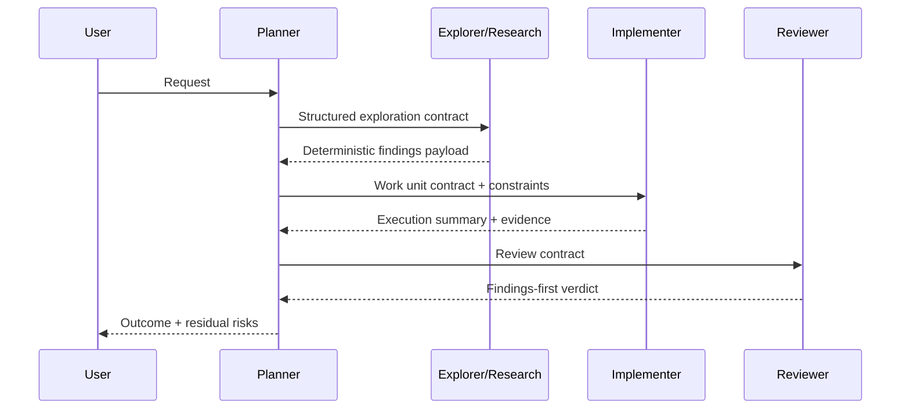
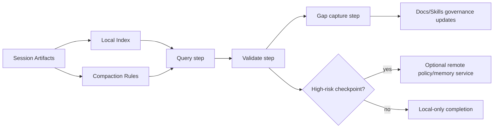

# System Upgrade Direction (2026)

This document converts recent research into a practical, phased upgrade direction for instruction-engine.

As of March 2026, the platform is also adopting first-class `@search` and `@execute` agents to make the staged discovery/application workflow explicit rather than implied.

## Scope and Intent

The goal is not to replace the current architecture. The goal is to improve four specific areas where research found quality gaps:

1. Documentation discoverability and progressive disclosure routing
2. Skill discovery precision and multi-skill execution behavior
3. Orchestration contracts and deterministic delegation behavior
4. Session memory quality without defaulting to heavy MCP overhead

This is the canonical system plan. Research inputs remain in `docs/research/**` and are non-canonical.

## Baseline Assessment (Current State)

| Area | Baseline | Main Gap |
|---|---|---|
| Progressive disclosure | Good layers | Weak links between docs, skills, and agents |
| Skill discovery | Strong on-demand vault model | Static keyword map and weak multi-skill behavior |
| Orchestration | Strong specialized agents | Inconsistent output contracts and context budgeting |
| Memory model | Strong file-based session state | Weak indexing/compaction conventions |

Primary baseline sources:
- `docs/research/progressive-disclosure-audit.md`
- `docs/research/skill-discovery-search-execute-audit.md`
- `docs/research/github-copilot-atlas-analysis.md`
- `docs/research/markdownlm-mcp-memory-analysis.md`

## Target Architecture

The target architecture keeps the current strengths (manifest-driven assets, skill vault, file-based state), and adds stronger routing, validation, and memory ergonomics.

```mermaid
flowchart LR
    U[User Request] --> O[Orchestrator]
    O --> D[Doc Discovery Protocol]
    O --> X[@search]
    X --> S[Skill and Doc Discovery]
    O --> E[@execute]
    E --> A[Agent Routing Contract]

    D --> DI[docs/system/index.md]
    DI --> DM[MOCs]
    DM --> DN[Atomic Nodes]

    S --> SD[Keyword + Stack + Semantic Fallback]
    SD --> SV[skills-vault]

    A --> AC[Strict Output Contracts]
    A --> AB[Context Budget Rules]

    O --> M[Session Memory Layer]
    M --> MF[File-first Memory]
    M --> MI[Index + Compaction]
    M --> MX[Optional MCP Checkpoints]

    DN --> V[Validation and CI Gates]
    SV --> V
    AC --> V
    MI --> V
```

## Upgrade Workstreams

## Program Execution Contract

Execution accountability for this program is role-based and mandatory.

| Workstream | Accountable Owner Role | Key Dependencies | Exit Gate |
|---|---|---|---|
| WS1 Documentation Discovery | Docs Lead | None | Doc-discovery protocol shipped and docs graph route tests pass |
| WS2 Skill Discovery 2.0 | Skills Lead | WS1 routing conventions | Resolver chain and map-sync validator pass in CI |
| WS3 Orchestration Contracts | Orchestrator Lead | WS2 multi-skill policy | Output-schema contract tests and fan-out guardrails pass |
| WS4 Memory 2.0 | Session-State Lead | WS3 contract metadata | Memory index/compaction policy tests pass |
| WS5 Governance/Drift | Platform Quality Lead | WS1-WS4 signals | Upgrade scorecard and gate reports published |

Phase transitions require explicit go/no-go sign-off by the accountable owner role and the Platform Quality Lead.

## WS1: Documentation Discovery and Progressive Disclosure 2.0

### Why

Research shows the docs graph is structurally solid, but weakly discoverable by agents.

### Upgrades

1. Add a doc-discovery protocol to canonical instructions that mirrors skill-discovery behavior.
2. Enrich thin MOCs with decision-routing guidance, not just link lists.
3. Add explicit cross-links between system docs and relevant skills.
4. Define a research-to-canonical promotion protocol with explicit acceptance criteria.

### Concrete Changes

1. Update `engine-assets/copilot-instructions.md` with explicit "documentation discovery" steps.
2. Expand thin MOCs in `docs/system/mocs/*.md` to include "when to read" guidance.
3. Add `Related docs` blocks in high-impact skills (`skill-discovery`, `security`, testing skills).
4. Add a promotion checklist node in `docs/system/` and link it from `docs/system/index.md`.

### Success Metrics

1. 90% of doc lookups should start from `docs/system/index.md` or a MOC route.
2. Mean file reads for common architecture questions should drop by at least 20%.
3. MOCs should average at least 3 high-value outbound links plus routing notes.

### Implementation Work Units

| WU | Deliverable | Primary Files | Acceptance Checks |
|---|---|---|---|
| WS1-WU-01 | Doc-discovery protocol added to canonical instructions and mirror | `engine-assets/copilot-instructions.md`, `.github/copilot-instructions.md` | `node scripts/validate-doc-graph.js` plus mirrored-section parity checks pass |
| WS1-WU-02 | Thin MOCs enriched with routing guidance (`when to read`, `see also`, `depends on`) | `docs/system/mocs/*.md` | Doc graph passes and MOC links resolve cleanly |
| WS1-WU-03 | Research-to-canonical promotion checklist published | `docs/system/research-promotion-checklist.md`, `docs/system/index.md` | Checklist linked from index and MOCs; graph validator passes |
| WS1-WU-04 | Skill-to-doc cross-link standard established | `engine-assets/skills/*/SKILL.md` (starting with high-impact skills) | Spot-audit confirms `Related docs` section in target skills |

## WS2: Skill Discovery 2.0 (Search/Execute Hardened)

### Why

The vault model is excellent, but discovery quality drops on ambiguity and multi-domain tasks.

### Upgrades

1. Introduce a deterministic resolver chain: stack detection -> keyword map -> skill metadata search -> semantic fallback.
2. Add explicit multi-skill orchestration policy (primary skill + supporting skills + token budget).
3. Replace manually maintained keyword maps with generated or validated maps from skill frontmatter.
4. Add telemetry for skill selection quality and miss categories.
5. Route discovery through first-class `@search` and `@execute` agents so vault loading becomes explicit and observable.

### Resolver Design

```mermaid
flowchart TD
    Q[Task Request] --> R1{Stack match?}
    R1 -->|yes| L1[Load stack-derived skills]
    R1 -->|no| R2{Keyword exact match?}
    R2 -->|yes| L2[Load mapped skill]
    R2 -->|no| R3{Frontmatter metadata match?}
    R3 -->|yes| L3[Load matched skill(s)]
    R3 -->|no| R4{Semantic fallback enabled?}
    R4 -->|yes| L4[Load top semantic candidates]
    R4 -->|no| L5[Fallback to safe generic handling]

    L1 --> P[Apply multi-skill policy]
    L2 --> P
    L3 --> P
    L4 --> P
    L5 --> P

    P --> T[Track decision + outcome]
```

### Concrete Changes

1. Extend `engine-assets/skills/skill-discovery/SKILL.md` with resolver-order and multi-skill policy.
2. Add validation in `scripts/validate-manifest.js` or a dedicated script to detect unmapped skills.
3. Add skill metadata indexing from SKILL frontmatter (`description`, trigger phrases, tags).
4. Add a discovery telemetry schema for miss reasons (keyword miss, ambiguity, stale map, no route).
5. Add first-class `@search` and `@execute` agent prompts that consume the existing vault model instead of replacing it.

### Success Metrics

1. Reduce ambiguous discovery outcomes by at least 30%.
2. Reduce stale keyword-map incidents to near zero through validation gates.
3. Increase multi-skill correct-routing confidence in audits and regression tests.

### Implementation Work Units

| WU | Deliverable | Primary Files | Acceptance Checks |
|---|---|---|---|
| WS2-WU-01 | Resolver-order contract (stack -> keyword -> metadata -> semantic fallback) | `engine-assets/skills/skill-discovery/SKILL.md` | Deterministic resolver documented and reviewed |
| WS2-WU-02 | Stack detection rule expansion for uncovered skills | `engine-assets/skills/stack-detector/SKILL.md` | New rules present for targeted gaps (for example `openai`, `Microsoft.Agents*`) |
| WS2-WU-03 | Skill-map parity validator implemented | `scripts/validate-skill-discovery-map.js` (new), `scripts/package.json` | Validator runs in CI and fails on unmapped vault skills |
| WS2-WU-04 | Skill metadata index generation contract | `scripts/generate-skill-metadata-index.mjs` (new), `engine-assets/skills/**/SKILL.md` | Generated index is deterministic and consumed by discovery flow |
| WS2-WU-05 | Discovery telemetry schema and ingestion points | `local-tracker/src/messagingGateway/commandRouter.ts`, `local-tracker/src/messagingGateway/status.ts`, `docs/system/` telemetry node | Ambiguity/miss reason events appear in sampled telemetry |

## WS3: Orchestration Contracts and Context-Economics Hardening

### Why

Atlas research found practical prompt-level orchestration tactics that improve determinism without heavy infrastructure.

### Upgrades

1. Standardize strict subagent output contracts for exploration and review flows.
2. Add explicit context-budget thresholds and fan-out limits to planner/orchestrator prompts.
3. Keep allowlist-first delegation governance while adopting stronger handoff semantics.
4. Add explicit phase-gate metadata so each handoff has deterministic required outputs.

### Orchestration Contract Flow



### Concrete Changes

1. Update orchestrator and planner prompts to include explicit context-budget rules.
2. Add shared output schema guidance for explorer/reviewer agents.
3. Keep curated delegation allowlists as default; avoid wildcard routing by default.
4. Add contract test fixtures in validation scripts for output schema drift.

### Success Metrics

1. Fewer ambiguous subagent results in planning and review chains.
2. Lower average context usage for equivalent task complexity.
3. Higher first-pass review determinism (clear verdict structure and evidence fields).

### Implementation Work Units

| WU | Deliverable | Primary Files | Acceptance Checks |
|---|---|---|---|
| WS3-WU-01 | Shared explorer/reviewer output schemas formalized | `engine-assets/agents/code-explorer.agent.md`, `engine-assets/agents/code-reviewer.agent.md`, `engine-assets/agents/final-reviewer.agent.md` | Schema examples and required fields enforced in prompts |
| WS3-WU-02 | Context-budget and fan-out rules standardized in planner/orchestrator agents | `engine-assets/agents/elegy-planner.agent.md`, `engine-assets/agents/elegy-orchestrator.agent.md`, `engine-assets/agents/orchestrator.agent.md` | Budget/fan-out rules present and consistent |
| WS3-WU-03 | Handoff contract metadata standardized | `engine-assets/agents/elegy-direction.agent.md`, `engine-assets/agents/elegy-subplanner.agent.md` | Planner-to-executor outputs include deterministic required fields |
| WS3-WU-04 | Orchestration contract validator implemented | `scripts/validate-orchestration-contracts.js` (new) | Validator fails on schema drift and missing required sections |

## WS4: File-First Memory 2.0 with Optional MCP Checkpoints

### Why

Current file-based memory is cost-efficient and robust. The main gap is retrieval ergonomics, not storage substrate.

### Upgrades

1. Keep file-based memory as primary authority.
2. Add local memory index and compaction conventions.
3. Introduce optional remote validation/retrieval checkpoints for high-risk gates only.
4. Standardize a query -> validate -> gap loop locally, regardless of backend choice.

### Memory Evolution Model



### Concrete Changes

1. Extend session-state conventions in `docs/system/session-state-artifacts.md` with index and compaction rules.
2. Add a lightweight `_index.md` convention under session-state roots.
3. Add archive/summary policy for large `proposition.md` files.
4. Gate optional external memory calls behind explicit risk checkpoints.

### Success Metrics

1. Reduced memory retrieval cost for resumed sessions.
2. Lower stale-context risk in long-running sessions.
3. No required MCP baseline overhead for standard local workflows.

### Implementation Work Units

| WU | Deliverable | Primary Files | Acceptance Checks |
|---|---|---|---|
| WS4-WU-01 | Session-state index convention formalized | `docs/system/session-state-artifacts.md` | Contract update merged with examples and migration notes |
| WS4-WU-02 | Proposition compaction/archive policy formalized | `docs/system/session-state-artifacts.md`, session-state templates | Compaction rules and archive trigger thresholds documented |
| WS4-WU-03 | Local memory indexing helper implemented | `scripts/session-memory-index.mjs` (new) | Tool generates deterministic `_index.md` output |
| WS4-WU-04 | Memory convention validator implemented | `scripts/validate-session-memory-conventions.js` (new) | Validator catches missing index/compaction markers |
| WS4-WU-05 | Optional remote checkpoint policy integrated as gated path | `engine-assets/copilot-instructions.md`, `docs/system/mcp-workflow.md` | Default path remains local; checkpoint usage requires explicit risk gates |

## WS5: Governance, Validation, and Drift Control

### Why

Most proposed upgrades fail without enforcement and observable outcomes.

### Upgrades

1. Add CI validators for doc routes, skill map sync, and output contract schemas.
2. Add a unified upgrade scorecard tracked in docs and/or runtime health outputs.
3. Add quarterly governance review checkpoints tied to changelog entries.

### Concrete Changes

1. Extend validation scripts for new checks (doc-discovery references, skill map sync, metadata completeness).
2. Add a system-upgrade scorecard node in `docs/system/`.
3. Require changelog entries for all behaviorally meaningful orchestration/skills changes.

### Success Metrics

1. Drift incidents caught in CI before release.
2. Measurable improvement in routing quality and context efficiency.
3. Clear traceability from change -> contract -> validation evidence.

### Implementation Work Units

| WU | Deliverable | Primary Files | Acceptance Checks |
|---|---|---|---|
| WS5-WU-01 | Upgrade scorecard artifact and schema | `docs/system/system-upgrade-scorecard.md` (new) | Baseline and periodic measurements recorded in a consistent format |
| WS5-WU-02 | Validation pipeline wiring for new validators | `scripts/package.json`, CI task config, `README.md` command docs | New validators execute in standard validation workflow |
| WS5-WU-03 | Changelog/governance policy enforcement note | `docs/system/instruction-changelog.md`, `docs/system/doc-graph-spec.md` | Behavioral changes consistently include changelog + graph wiring |
| WS5-WU-04 | Quarterly governance review checklist | `docs/system/governance-review-checklist.md` (new) | Review checklist used at release cadence |

## Prioritized 90-Day Execution Plan

### Phase 1 (Weeks 1-3): Foundations

1. Implement doc-discovery protocol in canonical instructions.
2. Expand thin MOCs with routing guidance.
3. Add skill map sync validator and baseline telemetry schema.

Definition of Done:
- Doc-discovery protocol text merged into canonical instructions and mirrored where required.
- MOC updates merged with doc-graph validation passing.
- Baseline metrics captured and written to the upgrade scorecard artifact.

### Phase 2 (Weeks 4-7): Discovery and Orchestration

1. Implement resolver chain enhancements in skill-discovery docs/contracts.
2. Roll out context-budget and output-schema contracts for planner/explorer/reviewer.
3. Add regression tests for routing and contract shape.

Definition of Done:
- Resolver-order and multi-skill policy are merged and validated.
- Contract fixtures for explorer/reviewer output schemas pass in CI.
- Fan-out/context-budget checks show no regressions versus baseline in sampled runs.

### Phase 3 (Weeks 8-12): Memory and Governance

1. Introduce file-first memory index/compaction conventions.
2. Add optional checkpoint policy for remote validation/memory.
3. Publish upgrade scorecard and finalize governance cadence.

Definition of Done:
- Session-state index/compaction conventions merged with deterministic rules.
- Optional checkpoint policy merged with explicit gating and disabled-by-default path.
- Quarterly governance review checklist adopted and changelog workflow enforced.

## Risks and Mitigations

| Risk | Impact | Mitigation |
|---|---|---|
| Over-engineering discovery stack | Higher maintenance burden | Keep strict phase gating and metric-based go/no-go |
| Contract changes break existing behavior | Regression in agent outcomes | Add additive contracts first, keep compatibility aliases |
| Memory policy complexity grows too fast | Tooling friction | Keep file-first defaults and add remote checkpoints only where needed |
| Documentation drift during rollout | Reduced trust in docs | Require changelog + index/MOC update in same change set |

## Validation Matrix

| Objective | Metric | Evidence Source | Threshold | Cadence | Owner Role |
|---|---|---|---|---|---|
| Improve doc routing | `% lookups starting at docs/system/index or MOC` | Runtime telemetry + sampled traces | >= 90% | Weekly | Docs Lead |
| Reduce discovery ambiguity | `ambiguous routing rate` | Skill discovery telemetry | -30% vs baseline | Weekly | Skills Lead |
| Prevent map drift | `unmapped skill count` | Map-sync validator report | 0 unmapped skills | Per PR | Skills Lead |
| Strengthen orchestration determinism | `schema-valid subagent outputs` | Contract test fixtures | 100% pass | Per PR | Orchestrator Lead |
| Improve memory retrieval ergonomics | `median resumed-session retrieval reads` | Session-state telemetry sample | -20% vs baseline | Bi-weekly | Session-State Lead |
| Control upgrade drift | `failed upgrade gate count` | CI gate report + scorecard | 0 unresolved failures on release branch | Per release | Platform Quality Lead |

## Rollback and Safe-Revert Plan

Rollback is trigger-based and scoped by workstream.

Trigger conditions:

1. Any release-branch gate regression in routing, discovery, or contract validation.
2. Significant context-cost regression above agreed threshold for two consecutive measurement windows.
3. Memory retrieval or session-resume regressions with unresolved severity-high defects.

Rollback procedure:

1. Freeze forward merges for the affected workstream.
2. Revert only the affected contract/policy delta (not unrelated workstreams).
3. Re-enable compatibility alias paths where applicable.
4. Re-run mandatory validation bundle and document outcome in changelog.

Post-rollback verification requirements:

1. Doc graph validation passes.
2. Manifest validation passes.
3. Workstream-specific contract tests pass.
4. Upgrade scorecard marks rollback status and reopened action items.

## Documentation Maintenance Protocol (Mandatory)

For each upgrade change set:

1. Update affected canonical node(s) in `docs/system/**`.
2. Update any impacted MOC links/routing notes.
3. Update `docs/system/instruction-changelog.md` with behavior-level summary.
4. Validate docs graph and contract scripts before merge.

## Validation Entry Points

Run the narrowest relevant checks:

1. `node scripts/validate-doc-graph.js`
2. `node scripts/validate-manifest.js`
3. `node scripts/validate-planpack.js <path>` when planning-contract changes are touched
4. `node scripts/validate-skill-discovery-map.js` for skill mapping parity (new)
5. `node scripts/validate-orchestration-contracts.js` for output schema conformance (new)
6. `node scripts/validate-session-memory-conventions.js` for index/compaction rules (new)

Release gate bundle (target state):

1. Run all validation entry points above.
2. Publish upgrade scorecard snapshot artifact.
3. Confirm changelog entry and MOC/index updates for the change set.

## Related Canonical Docs

- [[orchestration-and-agents]] [docs/system/mocs/orchestration-and-agents.md](docs/system/mocs/orchestration-and-agents.md)
- [[moc-skills-governance]] [docs/system/mocs/skills-governance.md](docs/system/mocs/skills-governance.md)
- [[session-state]] [docs/system/mocs/session-state.md](docs/system/mocs/session-state.md)
- [[instruction-changelog]] [docs/system/instruction-changelog.md](docs/system/instruction-changelog.md)
- [[doc-graph-spec]] [docs/system/doc-graph-spec.md](docs/system/doc-graph-spec.md)
